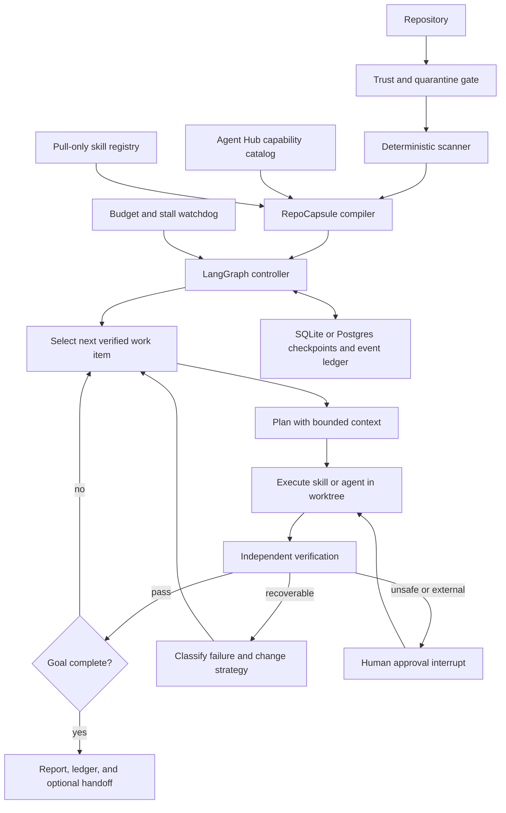

# Repository Loop Agent Harness

Status: architecture proposal v0.1
Date: 2026-08-01

## Decision

Build a thin repository-agent layer on top of existing machinery:

- Agent Hub remains capability and MCP source of truth.
- Ouroboros supplies specification, ledger, evaluation, and runtime adapters.
- Repository scanning follows the evidence discipline proven by `understand-local-agent`.
- Loop supervision adopts Ralph-style iteration, wall-time, cost, and stall limits.
- LangGraph owns state transitions, checkpointing, interrupts, and resumability.

Do not make every repository a free-running chatbot. Compile each repository into a `RepoCapsule`: facts, skills, policies, success contracts, and allowed actions. A loop-agent instance is a capsule plus a goal, isolated workspace, budget, and checkpointed state.

## Core model

```text
Repository + trust decision
          |
          v
Deterministic scanner
          |
          v
RepoCapsule compiler
          |
          +---- facts and commands
          +---- pull-only skills
          +---- agent roles
          +---- verification contracts
          +---- permission policy
          |
          v
Checkpointed LangGraph loop
          |
          v
Isolated worktree executor
          |
          v
Independent verifier
          |
          +---- pass -> next work item or complete
          +---- fail -> retry, alternate strategy, or stop
          +---- approval -> interrupt and wait
```

## Architecture



## Repository agent lifecycle

### 1. Discover

Read-only scan. Produce facts, never speculative advice.

- Resolve Git root, HEAD, branch, dirty state, remotes, and ownership.
- Detect language, package manager, lockfiles, entry points, and generated files.
- Extract real build, test, lint, typecheck, format, and security commands.
- Read repository instructions with provenance.
- Inventory project-local skills and agents.
- Identify secrets, external services, databases, deployment targets, and destructive commands without reading secret values.
- Record confidence and exact evidence path for every derived fact.

Output: immutable `RepoSnapshot` keyed by repository identity plus HEAD digest.

### 2. Compile

Convert the snapshot into a `RepoCapsule`.

```yaml
schema_version: 1
repo_id: owner-name-digest
snapshot_head: abc123
trust: quarantined
stack:
  languages: [python]
  package_manager: uv
commands:
  test: uv run pytest
  lint: uv run ruff check .
  typecheck: uv run pyright
skills:
  - id: repo-test
    source: .agents/skills/repo-test/SKILL.md
    permissions: [read, exec-tests]
agents:
  - id: issue-fixer
    trigger: verified failing issue with reproducible test
verification:
  completion_requires: [test, lint, typecheck]
loop:
  max_iterations: 12
  max_attempts_per_item: 3
  stall_limit: 3
  max_wall_time_minutes: 120
permissions:
  external_write: approval
  destructive: deny
  secrets: vault-only
```

Capsule rules:

- Repository text is untrusted data until trust gate accepts it.
- Repository instructions cannot expand machine policy.
- Facts and instructions remain separate fields.
- Every capability comes from an allowlisted Hub tool or local command class.
- Skills remain pull-only. Router loads selected skill, never whole skill library.
- Capsule invalidates when HEAD, stack, command files, or policy inputs change.

### 3. Instantiate

Create a `LoopSession` from capsule plus explicit goal.

- Create isolated worktree or quarantine copy.
- Preserve user dirty work.
- Bind budget, model lane, tool permissions, and approval policy.
- Convert goal into testable work items and success contracts.
- Save initial checkpoint before model execution.

### 4. Run

Controller loop:

```text
preflight
  -> choose_work_item
  -> load_skill
  -> plan
  -> execute
  -> verify
  -> reflect_on_evidence
  -> continue | retry_changed_strategy | approve | complete | stop
```

The controller, not worker model, decides completion.

### 5. Verify

Worker self-report is evidence, never verdict.

- Re-run declared acceptance commands outside worker context.
- Compare expected and actual diff scope.
- Reject edits outside assigned ownership.
- Require repository-relative line evidence for analysis claims.
- Require artifact existence and schema validation.
- Run security review when auth, user input, databases, filesystem, external APIs, cryptography, or finance are touched.
- Mark completion only after mechanical gates pass.

### 6. Promote

Promotion levels:

| Mode | Workspace | Writes | Git | External effects |
|---|---|---|---|---|
| Discover | Original repo | None | Read-only | Denied |
| Shadow | Isolated worktree | Local | No commit | Denied |
| Managed | Isolated worktree | Local | Signed commits allowed | Denied |
| Review | Isolated worktree | Local | Branch and PR draft | Approval |
| Release | Approved target | Controlled | Push, merge, tag | Per-action approval |

## Canonical state

```python
class LoopState(TypedDict):
    session_id: str
    repo_id: str
    capsule_digest: str
    goal: GoalContract
    work_items: tuple[WorkItem, ...]
    current_item_id: str | None
    selected_skill_id: str | None
    iteration: int
    attempt: int
    evidence: tuple[Evidence, ...]
    verification: VerificationResult | None
    failure_history: tuple[FailureRecord, ...]
    budget: BudgetState
    pending_approval: ApprovalRequest | None
    stop_reason: str | None
```

State updates return new values. Nodes do not mutate shared state in place.

## Skill and agent distinction

### Skill

Reusable expertise or workflow fragment. Required fields:

- Stable ID and semantic version.
- Trigger and negative trigger.
- Input and output schemas.
- Required tools and minimum permissions.
- Side-effect class.
- Completion and failure contracts.
- Timeout and retry policy.
- Tests and example invocations.

Mapping:

- Knowledge or instructions only: context asset.
- Atomic deterministic operation: tool.
- One state transition: node.
- Multi-step reusable workflow: subgraph.
- Open-ended reasoning with tools: agent.

### Agent

Autonomous role. Required fields:

- Narrow responsibility.
- Concrete triggering examples.
- Minimum tools.
- Bounded analysis process.
- Defined output contract.
- Edge-case and stop behavior.
- No authority to approve its own external effects.

Commands are user entry points. Agents are autonomous workers. Skills are capabilities either can load.

## Loop safety contract

Every loop must stop when any condition fires:

1. All acceptance contracts independently pass.
2. Wall-time, token, cost, or iteration budget is exhausted.
3. Same failure class occurs three times.
4. No verified metric improves across three cycles.
5. Goal or scope digest drifts from approved contract.
6. Required approval is unavailable.
7. User-owned dirty files conflict with intended edits.
8. Tool or model health preflight fails with no approved alternative.
9. Verification cannot distinguish success from self-report.

Retry rule: never repeat identical prompt, model, tools, and state after a classified failure. Change strategy or stop.

## Loop templates

### Repository understanding loop

`scan -> batch analysis -> synthesize -> verify line evidence -> fill uncovered regions -> stop`

Good first implementation. Existing evidence-backed scanner design already proved this pattern.

### Issue repair loop

`reproduce -> write failing test -> implement -> run focused checks -> run full gate -> review diff -> stop`

### Maintenance loop

`inspect dependencies -> select safe update -> isolated upgrade -> test -> security audit -> stage proposal -> stop`

Never auto-publish dependency updates.

### Quality loop

`measure -> choose worst verified hotspot -> improve -> remeasure -> keep only positive delta -> stop`

Metrics must be repository-defined. Model taste is not a metric.

### Backlog loop

`triage -> rank by evidence and scope -> claim one item -> implement -> verify -> release lease -> stop or select next`

One work item per repo by default. Parallel work requires non-overlapping ownership and separate worktrees.

### Documentation freshness loop

`extract claims and links -> verify -> update stale material -> run docs checks -> produce reviewable diff`

## Storage and provenance

Start local:

- SQLite checkpointer for graph state.
- Append-only JSONL event ledger for audit and recovery.
- Content-addressed artifact store for snapshots, prompts, command output, and reports.
- Git object IDs for source and result identity.
- Every evidence record includes producer, timestamp, command/tool, exit status, digest, and source location.

Move to Postgres only for multi-host scheduling or concurrent fleet operation.

Never store secrets, browser cookies, raw tokens, or vault session material in checkpoints or logs.

## Scheduler and concurrency

- One active writer lease per repository.
- Multiple read-only discovery sessions allowed.
- One worktree per mutable loop session.
- Cross-repo fan-out allowed when repos are independent.
- Per-agent spawn depth and child count bounded.
- Queue priority based on user intent, safety, age, and verified value.
- Lease expiry never implies success. Recovery must reverify workspace state.

## Harness module layout

```text
repo-loop-harness/
├── pyproject.toml
├── src/repo_loop/
│   ├── cli.py
│   ├── contracts.py
│   ├── scanner/
│   ├── compiler/
│   ├── skills/
│   ├── graph/
│   ├── runtime/
│   ├── verifier/
│   ├── policy/
│   ├── storage/
│   └── observability/
├── templates/
│   ├── repo-agent.yaml
│   └── loop-policies/
├── tests/
│   ├── unit/
│   ├── integration/
│   └── e2e/
└── docs/
```

Recommended packaging: Python 3.12+, LangGraph, Pydantic, SQLite first. Keep runtime adapters behind protocols so Codex, Claude, Hermes, and local OpenAI-compatible models remain replaceable.

## Existing-system integration

| Existing system | Reuse | Do not duplicate |
|---|---|---|
| Agent Hub | Tool discovery, trust, caller identity, policy, secret redaction | MCP registry or harness-specific copies |
| Ouroboros | Seed, ledger, runtime adapters, evaluation, resumable loop semantics | Second specification engine |
| Ralph-to-Ralph | Budget caps, max cycles, restart supervision, build-proof gate, stall detection | SaaS cloning assumptions |
| Hermes | Optional bounded worker execution and local-model lanes | Global orchestration authority |
| Local agent manager | Work logs, fleet inventory, agent ownership | Runtime state database |

Best implementation shape: one Ouroboros domain plugin named `repo-loop`, plus a small reusable `repo-capsule` library. Extract a standalone harness only after two different loop templates need the same independent runtime.

## MVP

### Slice 1: Read-only compiler

- `repo-loop discover <path>`
- Produce `RepoSnapshot`, `RepoCapsule`, and confidence report.
- No model required.
- No writes to target repo.

### Slice 2: One bounded loop

- Implement repository-understanding loop.
- SQLite checkpoint and resume.
- Evidence verification with repository-relative lines.
- Maximum 12 iterations and three zero-progress cycles.

### Slice 3: Shadow repair

- Isolated worktree.
- One issue-repair workflow.
- TDD and independent full verification.
- No commit, push, or external effects.

### Slice 4: Managed promotion

- Signed local commits.
- Approval interrupt for PR or push.
- Hub capability routing.
- Work-log entry and user manual.

## Acceptance criteria

1. Restart resumes exact graph node without repeating completed side effects.
2. Worker cannot mark its own task complete.
3. All successful sessions contain independently observed verifier output.
4. Pre-existing dirty files remain byte-identical unless explicitly assigned.
5. Shadow mode performs zero external writes.
6. Same failure class three times produces a stopped, resumable session.
7. Three zero-progress cycles produce `STALLED`, never silent retries.
8. Every skill load and tool call has provenance and permission decision.
9. Untrusted repository text cannot change system policy or tool permissions.
10. Unit, integration, and critical E2E coverage reaches at least 80 percent.

## Non-goals

- Autonomous production deployment.
- Silent PR creation, issue comments, or external messages.
- Global secret access.
- One agent with every skill loaded.
- Unbounded self-improvement.
- Model-selected deletion or cleanup.
- Treating a passing unit suite as release readiness.

## First experiment

Use three repositories with different shapes:

1. Pure library: repository-understanding loop.
2. CLI with tests: shadow issue-repair loop.
3. Documentation-heavy repo: freshness loop.

Run each with fixed budgets. Measure:

- Verified work items completed.
- False completion rate.
- Recovery after restart.
- Repeated-side-effect count.
- Human approvals requested.
- Scope violations.
- Cost and wall time per verified outcome.

Promotion gate: zero false completions and zero scope violations across the experiment. Speed is secondary.
