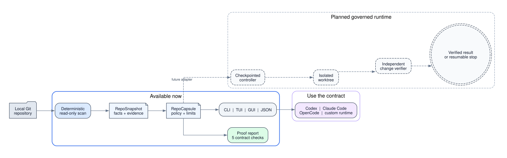

# Repository Loop Agent Harness

Turn a repository into a bounded, resumable agent runtime without turning its entire contents into one enormous prompt.

> **Status:** the deterministic repository scanner, capsule compiler, CLI wrapper, and read-only TUI are implemented. Runtime loop commands fail closed unless an external backend is configured. The checkpointed LangGraph executor remains a planned slice.



## What this project is

Repository Loop Agent Harness compiles a software repository into a `RepoCapsule`: a versioned description of its facts, commands, skills, agents, permissions, and success criteria. A checkpointed controller can then run bounded improvement loops against that capsule inside an isolated worktree.

Core promise:

```text
repository + explicit goal + policy
    -> RepoCapsule
    -> bounded loop session
    -> independently verified outcome
```

The repository does not become an unconstrained autonomous personality. It becomes a governed execution environment with a narrow set of discoverable capabilities.

## Quick start

Requirements: Python 3.12+ and [`uv`](https://docs.astral.sh/uv/).

```bash
git clone https://github.com/josephkehan-prog/repo-loop-harness.git
cd repo-loop-harness
uv sync

# Directly from the checkout
./repo-loop discover .
./repo-loop capsule show .
./repo-loop tui .
```

Install the `repo-loop` command in an isolated tool environment:

```bash
uv tool install .
repo-loop --help
```

The TUI has four views—Overview, Commands, Evidence, and Policy. Press `r` to rescan the repository and `q` to quit. Discovery is read-only and never creates files in the inspected repository.

## Why this exists

Most repository agents fail in predictable ways:

- They load too much context and lose important constraints.
- They accept worker self-reports as proof of completion.
- They retry identical approaches without measuring progress.
- They mutate a shared working tree and collide with user work.
- They treat repository instructions as trusted system policy.
- They run until token, time, or money limits fail externally.
- They blur tools, skills, agents, commands, and workflows into one prompt.

This harness makes those boundaries explicit.

| Failure | Harness response |
|---|---|
| Context overload | Pull only selected skills and bounded repository facts |
| False completion | Independent verifier owns verdict |
| Infinite retry | Attempt caps, failure classes, and stall detection |
| Workspace collision | One isolated worktree per mutable session |
| Prompt injection | Trust gate separates repository data from machine policy |
| Scope drift | Goal, capsule, and diff digests checked every cycle |
| Unsafe side effect | Human approval interrupt before external action |

## Workflow

1. **Trust** repository. New or external repositories begin quarantined.
2. **Scan** deterministic facts: stack, commands, entry points, tests, instructions, and dirty state.
3. **Compile** facts into immutable `RepoSnapshot`, then governed `RepoCapsule`.
4. **Instantiate** loop from capsule, explicit goal, budget, permissions, and isolated workspace.
5. **Select** one work item and one required skill.
6. **Execute** through bounded agent or deterministic node.
7. **Verify** using commands and evidence outside worker context.
8. **Reflect** on measured results, not prose confidence.
9. **Continue, retry differently, request approval, complete, or stop.**
10. **Persist** every transition for resume and audit.

Editable chart source: [`docs/workflow.dot`](docs/workflow.dot). Alternate render: [`docs/workflow.png`](docs/workflow.png).

## Core concepts

### Repository snapshot

`RepoSnapshot` records what can be proven about one repository revision.

Examples:

- Git root, HEAD, branch, remotes, and dirty paths.
- Languages, package managers, lockfiles, and runtime versions.
- Real build, test, lint, typecheck, and security commands.
- Entry points, generated files, ownership boundaries, and deployment surfaces.
- Repository-local instruction files with provenance.
- Available skills and agents without loading their full bodies.

Snapshot facts require evidence paths. Model-written guesses are excluded.

### Repository capsule

`RepoCapsule` converts snapshot facts into an executable policy contract.

```yaml
schema_version: 1
repo_id: example-cli-4f92d8
snapshot_head: 4f92d8a
trust: quarantined

stack:
  languages: [python]
  package_manager: uv

commands:
  test: uv run pytest
  lint: uv run ruff check .
  typecheck: uv run pyright

skills:
  - id: repo-test
    source: .agents/skills/repo-test/SKILL.md
    permissions: [read, exec-tests]

agents:
  - id: issue-fixer
    trigger: verified failing issue with reproducible test

verification:
  completion_requires: [test, lint, typecheck]

loop:
  max_iterations: 12
  max_attempts_per_item: 3
  stall_limit: 3
  max_wall_time_minutes: 120

permissions:
  external_write: approval
  destructive: deny
  secrets: vault-only
```

Capsule invalidates when relevant facts change, including Git HEAD, command files, lockfiles, policy, or skill manifests.

### Skill

Skill packages reusable expertise or workflow logic.

Required contract:

- Stable ID and semantic version.
- Positive and negative triggers.
- Input and output schemas.
- Required tools and minimum permissions.
- Side-effect classification.
- Completion and failure conditions.
- Timeout and retry policy.
- Tests and example invocations.

Skill maps to runtime form by control needs:

| Skill shape | Runtime form |
|---|---|
| Instructions or reference knowledge | Context asset |
| Atomic deterministic operation | Tool |
| Single state transition | Node |
| Reusable multi-step workflow | Subgraph |
| Open-ended reasoning with tools | Agent |

### Agent

Agent is autonomous role with narrow responsibility.

Each agent declares:

- Specific trigger and examples.
- Cases where it must not trigger.
- Minimum tool set.
- Bounded analysis process.
- Output schema.
- Error and stop behavior.
- Approval boundaries.

Commands are user entry points. Agents are autonomous workers. Skills are capabilities loaded by either.

### Loop session

Loop session binds capsule to one goal and one isolated workspace.

```python
class LoopState(TypedDict):
    session_id: str
    repo_id: str
    capsule_digest: str
    goal: GoalContract
    work_items: tuple[WorkItem, ...]
    current_item_id: str | None
    selected_skill_id: str | None
    iteration: int
    attempt: int
    evidence: tuple[Evidence, ...]
    verification: VerificationResult | None
    failure_history: tuple[FailureRecord, ...]
    budget: BudgetState
    pending_approval: ApprovalRequest | None
    stop_reason: str | None
```

Nodes return new state values. Shared state is never mutated across boundaries.

## Loop controller

Canonical graph:

```text
preflight
  -> choose_work_item
  -> load_skill
  -> plan
  -> execute
  -> verify
  -> reflect_on_evidence
  -> continue | retry_changed_strategy | approve | complete | stop
```

Controller owns state transition and completion. Worker owns assigned action only.

### Completion

Session completes only when:

- Every acceptance contract passes independently.
- Resulting diff stays inside approved scope.
- Required artifacts exist and validate.
- Repository gate passes from clean verifier context.
- No required approval remains pending.

Worker statement such as "tests pass" is evidence to inspect, not verdict.

### Retry

Retry must change at least one material input:

- Strategy.
- Skill.
- Tool set.
- Model or runtime.
- Context selection.
- Work-item decomposition.

Same prompt, model, tools, and state cannot repeat after classified failure.

### Stop conditions

Session stops when any condition fires:

1. Acceptance contracts pass.
2. Wall-time, token, cost, or iteration budget ends.
3. Same failure class occurs three times.
4. Verified metrics show no progress across three cycles.
5. Goal or scope digest changes unexpectedly.
6. Required approval is unavailable.
7. User-owned dirty files conflict with intended edits.
8. Model or tool health fails with no approved fallback.
9. Verifier cannot distinguish success from worker self-report.

Stopped sessions remain resumable.

## Execution modes

| Mode | Workspace | Local writes | Git | External effects |
|---|---|---:|---|---|
| Discover | Original repository | No | Read-only | Denied |
| Shadow | Isolated worktree | Yes | No commit | Denied |
| Managed | Isolated worktree | Yes | Signed commits | Denied |
| Review | Isolated worktree | Yes | Branch and draft PR | Approval |
| Release | Approved target | Controlled | Push, merge, tag | Per-action approval |

New repositories start in Discover. Promotion requires explicit trust and successful evidence gates.

## Loop templates

### Understand repository

```text
scan
  -> analyze bounded batches
  -> synthesize findings
  -> verify repository-relative evidence
  -> cover missed regions
  -> stop
```

Best first implementation. Read-only risk profile. Clear verification contract.

### Repair issue

```text
reproduce
  -> write failing test
  -> implement minimum fix
  -> run focused checks
  -> run full repository gate
  -> review diff scope
  -> stop
```

### Maintain dependencies

```text
inspect dependencies
  -> choose one safe update
  -> upgrade in worktree
  -> test
  -> security audit
  -> stage proposal
  -> stop
```

Dependency loop never auto-publishes.

### Improve quality

```text
measure
  -> choose worst verified hotspot
  -> change one bounded area
  -> remeasure
  -> keep positive delta or revert session result
  -> stop
```

Metrics come from repository contract, not model taste.

### Process backlog

```text
triage
  -> rank by evidence and scope
  -> lease one work item
  -> implement
  -> verify
  -> release lease
  -> stop or select next item
```

One mutable work item per repository by default.

## Verification model

Independent verifier runs outside worker context.

Verification responsibilities:

- Execute declared commands and capture exit status.
- Confirm worker did not hide or skip failures.
- Compare assigned scope against actual diff.
- Preserve pre-existing dirty files.
- Validate structured artifacts.
- Require repository-relative line evidence for analytical claims.
- Trigger security review for sensitive surfaces.
- Record evidence digest, producer, command, timestamp, and source revision.

Mechanical checks run first. Model review cannot override failing mechanical checks.

## Trust and security

Repository content is untrusted input.

### Instruction boundary

- Machine policy outranks repository instructions.
- Repository instructions cannot grant new tools or permissions.
- Facts and instructions remain separate capsule fields.
- Skill bodies load only after router selection and permission check.
- External repository content cannot become system policy automatically.

### Secret boundary

- Secret values never enter prompts, checkpoints, event ledgers, or reports.
- Credentials come from approved vault integration only.
- Session receives scoped capability, not broad environment dump.
- Missing credential stops relevant action instead of requesting plaintext storage.

### Side-effect boundary

Human approval required before:

- Push, merge, tag, release, or deployment.
- Creating or modifying remote issues and pull requests.
- External messages or publication.
- Money movement or paid API activation.
- Destructive file, database, or infrastructure action.
- Credential rotation or account changes.

## Scheduling and concurrency

- One writer lease per repository.
- Multiple read-only discovery sessions allowed.
- One worktree per mutable session.
- Cross-repository fan-out allowed for independent repositories.
- Spawn depth, child count, time, and cost bounded.
- Lease expiration never implies success.
- Recovery re-scans workspace and reruns verification before continuing.

## Persistence and audit

Local-first storage:

- SQLite for LangGraph checkpoints.
- Append-only JSONL for events.
- Content-addressed store for snapshots, prompts, outputs, and reports.
- Git object IDs for input and result identity.

Postgres becomes useful only for multi-host scheduling or concurrent fleet operation.

Every transition records:

- Session and repository identity.
- Capsule and goal digests.
- Node and attempt number.
- Selected skill and permissions.
- Tool call or command evidence.
- State transition result.
- Approval or stop reason.

## Why Ouroboros appears throughout the design

Ouroboros is mentioned because this design was created for an environment where it already provides several expensive primitives:

- Specification-first `Seed` contracts.
- Append-only execution ledger.
- Runtime adapters for multiple coding harnesses.
- Evaluation pipeline.
- Resume and recovery semantics.
- Plugin model for domain workflows.

Reusing those primitives avoids creating a second specification engine and second runtime router.

Ouroboros is not project identity. Repository Loop Agent Harness owns different domain:

| Component | Responsibility |
|---|---|
| Repository Loop Agent Harness | Compile repositories into governed capsules and run repository loops |
| Ouroboros | Specify goals, record execution, evaluate results, route runtimes |
| Agent Hub | Discover and authorize external capabilities |
| LangGraph | Execute checkpointed state machine |
| Worker runtime | Perform one assigned action |

Recommended first build is an Ouroboros `repo-loop` plugin plus small portable `repo-capsule` library. Core contracts should depend on protocols, not Ouroboros internals. An independent deployment can replace `OuroborosAdapter` without changing capsule or loop schemas.

Repeated mention therefore means "reuse available substrate," not "rename this project Ouroboros" or "make Ouroboros mandatory forever."

## Existing-system boundaries

| Existing system | Reuse | Do not duplicate |
|---|---|---|
| Agent Hub | Tool discovery, trust, caller identity, policy, redaction | MCP registry copies |
| Ouroboros | Seed, ledger, adapters, evaluation, resumable semantics | Specification engine |
| Ralph-style watchdog | Budgets, max cycles, restart supervision, stall detection | Product-cloning assumptions |
| Hermes | Optional bounded workers and local-model lanes | Global orchestration authority |
| Local agent manager | Work logs and fleet ownership | Runtime checkpoint database |

## CLI and TUI interface

The read-only commands are implemented:

```bash
# Read-only compilation
repo-loop discover /path/to/repository

# Inspect generated capsule
repo-loop capsule show /path/to/repository

# Open interactive terminal dashboard
repo-loop tui /path/to/repository
```

Add `--json` to `discover` or `capsule show` for stable, machine-readable output.

Runtime commands use an explicit adapter boundary:

```bash
# Configure a separately installed runtime adapter
export REPO_LOOP_BACKEND="/path/to/repo-loop-runtime-adapter"

# Run evidence-backed understanding loop
repo-loop run understand /path/to/repository --mode discover

# Run repair inside isolated worktree
repo-loop run repair /path/to/repository --issue 123 --mode shadow

# Resume exact checkpoint
repo-loop resume SESSION_ID

# Inspect status and evidence
repo-loop status SESSION_ID
```

The wrapper forwards arguments as an array without shell interpolation. With no backend configured, runtime commands exit with `EX_UNAVAILABLE`; they never simulate a successful loop.

## Repository layout

```text
repo-loop-harness/
├── README.md
├── ARCHITECTURE.md
├── repo-loop
├── pyproject.toml
├── src/repo_loop/
│   ├── __init__.py
│   ├── __main__.py
│   ├── backend.py
│   ├── cli.py
│   ├── discovery.py
│   └── tui.py
├── tests/
│   ├── test_cli.py
│   ├── test_discovery.py
│   └── test_tui.py
└── docs/
    ├── testing/
    ├── workflow.dot
    ├── workflow.png
    └── workflow.svg
```

Current stack: Python 3.12+ and Textual 8. Runtime providers remain replaceable through the `REPO_LOOP_BACKEND` process boundary. LangGraph, Pydantic, and SQLite belong to the later checkpointed-runtime slice, not the read-only compiler.

## Delivery plan

### Slice 1: Read-only capsule compiler

- [x] Implement `repo-loop discover <path>`.
- [x] Implement `repo-loop capsule show <path>`.
- [x] Add a read-only Textual dashboard.
- [x] Produce deterministic snapshot and capsule digests.
- [x] Use deterministic scanners only.
- [x] Write nothing to target repository.
- [ ] Expand scanners for repository instructions, ownership, and deployment surfaces.

Acceptance:

- Same repository revision produces same fact digests.
- Every fact has evidence path.
- Untrusted instructions cannot change policy.

## Development

```bash
uv sync --extra dev
uv run python -m unittest discover -s tests -v
uv run ruff check .
uv run coverage run -m unittest discover -s tests
uv run coverage report
```

The coverage gate is 80 percent. TDD evidence for the executable wrapper is recorded in [`docs/testing/cli-tui-wrapper.tdd.md`](docs/testing/cli-tui-wrapper.tdd.md).

### Slice 2: Repository-understanding loop

- Add SQLite checkpoints and resume.
- Analyze bounded batches.
- Verify every finding against repository-relative lines.
- Stop after 12 iterations or three zero-progress cycles.

Acceptance:

- Restart resumes exact node.
- Unsupported findings are dropped.
- No source files change.

### Slice 3: Shadow issue repair

- Create isolated worktree.
- Add reproduction and TDD loop.
- Run independent full verification.
- Prevent commit, push, and external effects.

Acceptance:

- User dirty files remain byte-identical.
- Worker cannot mark task complete.
- Full repository gate decides result.

### Slice 4: Managed promotion

- Allow signed local commits.
- Add approval interrupt for branch push and draft PR.
- Route capabilities through Agent Hub.
- Write work log and user manual.

Acceptance:

- Zero external action without recorded approval.
- Every tool call has provenance and permission decision.

## Project acceptance criteria

1. Restart resumes exact graph node without repeating completed side effects.
2. Worker cannot approve its own result.
3. Every successful session contains independently observed verifier output.
4. Pre-existing dirty files remain unchanged unless explicitly assigned.
5. Shadow mode performs no external writes.
6. Same failure class three times stops session.
7. Three zero-progress cycles produce `STALLED`.
8. Every skill load and tool call records provenance and policy decision.
9. Repository text cannot expand system policy or permissions.
10. Unit, integration, and critical E2E coverage reaches at least 80 percent.

## Non-goals

- Autonomous production deployment.
- Silent pull requests, issue comments, or external messages.
- Global credential access.
- Loading every skill into every worker.
- Unbounded self-improvement.
- Model-selected deletion or cleanup.
- Treating green unit tests as release readiness.

## First experiment

Test three repository shapes:

1. Pure library using understanding loop.
2. Tested CLI using shadow repair loop.
3. Documentation-heavy project using freshness loop.

Measure:

- Verified work items completed.
- False completion rate.
- Restart recovery.
- Duplicate side effects.
- Human approvals requested.
- Scope violations.
- Cost and wall time per verified result.

Promotion gate: zero false completions and zero scope violations. Speed remains secondary.

## Architecture reference

Full design: [`ARCHITECTURE.md`](ARCHITECTURE.md).
