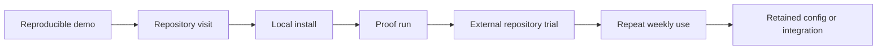

# RepoLoop 30-day promotion plan

> Promote RepoLoop as verified repository context and coding-agent guardrails. Do not market the current release as a working autonomous coding loop or independent code-change verifier.

This plan converts the current developer preview into evidence-led demand validation. No paid promotion is required.

## Positioning

Primary message:

> RepoLoop gives AI coding agents a deterministic repository contract before execution: real commands, evidence paths, trust state, permissions, and stop limits.

Supporting message:

> Local-first, agent-agnostic, and fail-closed. Use the CLI, TUI, browser GUI, or JSON contract with the coding agent you already prefer.

Avoid leading with LangGraph, MCP, recursive loops, autonomous agents, or architecture diagrams. Those describe implementation choices rather than the user's problem.

## Target users

| Audience | Pain | RepoLoop entry point |
| --- | --- | --- |
| Open-source maintainers | Agents guess commands or ignore repository state | `repo-loop proof` and `discover --json` |
| Heavy Codex or Claude Code users | Repeated context exploration and weak provenance | Portable RepoCapsule JSON |
| Agent-tool builders | Need deterministic context and policy boundaries | Scanner and runtime adapter contracts |
| Platform and security engineers | Need local inspection and fail-closed defaults | Quarantine, permissions, and evidence paths |

## Validation funnel

Optimize for proof runs and repeat use, not impressions.

## Week 1: package the proof

- Publish the outcome-first README and explicit current limits.
- Keep `repo-loop proof . --json` green in CI on Python 3.12 and 3.13.
- Record the unedited 90-second workflow in [proof-demo.md](proof-demo.md).
- Create one repository capsule example from a recognizable public Python project.
- Open a GitHub discussion asking maintainers which discovered facts are missing.
- Add screenshots or a short GIF only when they show real output from the current commit.

Exit condition: a stranger can clone, run the proof, understand the boundary, and reproduce the result in under five minutes.

## Week 2: recruit design partners

- Contact 10 maintainers who already use a coding agent on an active repository.
- Offer a free repository-context review, not a sales call.
- Ask each maintainer to run RepoLoop against one repository without changing its configuration first.
- Record missing commands, false detections, confusing output, and whether they ran it again.
- Convert repeated discovery failures into public issues with minimal fixtures.

Use this outreach message:

> I am testing RepoLoop, a local-first tool that gives coding agents deterministic repository context and fail-closed policy. It does not edit code. Would you run one read-only proof against a repository where your agent often guesses the wrong commands? I will use the result to improve the scanner and share the findings back with you.

Exit condition: 10 external repository trials and at least 3 maintainers willing to rerun after a fix.

## Week 3: publish evidence

- Publish one technical article: “What coding agents guess incorrectly about real repositories.”
- Report the sample, fixture selection, false positives, and false negatives.
- Release the terminal recording and the raw proof JSON.
- Share one failure case before sharing a success case.
- Update README examples from external repositories only with maintainer permission.
- Avoid announcing a reusable GitHub Action until the repository actually ships one.

Exit condition: at least 5 repeat proof runs by people outside the project owner account.

## Week 4: launch the narrow wedge

Publish only after Weeks 1 through 3 produce reproducible external evidence.

Recommended sequence:

1. GitHub release with exact current limits and proof transcript.
2. Show HN with the repository link and unedited demonstration.
3. Technical Reddit posts adapted to each community.
4. X thread built around one repository failure and its evidence path.
5. Two-minute YouTube walkthrough linked from the README.

Reply to technical criticism with fixtures, commands, and issues. Do not argue from the architecture document.

## Channel playbook

| Channel | Format | Message | Call to action |
| --- | --- | --- | --- |
| GitHub | README, release, issues | Inspectable contracts and exact limits | Run `repo-loop proof .` |
| Show HN | Working demo and technical narrative | The system around a coding model needs verified repository facts | Try it on an unfamiliar repository |
| Reddit | Failure analysis with commands | What repository scanners miss and how evidence is attached | Share a failing fixture |
| X | Short screen capture and thread | One guessed command, one verified replacement | Link to proof and issue |
| YouTube | Two-minute unedited walkthrough | Clone, prove, inspect, confirm no writes | Reproduce with the same commit |

Relevant communities include r/AI_Agents, r/LocalLLaMA, r/ClaudeCode, r/codex, and r/LangChain. Follow each community's self-promotion rules and participate before posting a project link.

## Launch copy

GitHub description:

> Local-first repository context and fail-closed guardrails for AI coding agents. Deterministic snapshots, evidence paths, CLI, TUI, and GUI.

Show HN title:

> Show HN: RepoLoop - verified repository context for any coding agent

Reddit title:

> I built a read-only tool that shows what your coding agent would otherwise guess about a repository

X opening:

> Coding agents can write code. They still guess which repository commands and constraints are real. RepoLoop turns those facts into a deterministic, evidence-backed contract.

YouTube title:

> Give Codex or Claude Code verified repository context in 90 seconds

## Search positioning

Use these phrases naturally in documentation, releases, and video descriptions:

- AI coding agent guardrails;
- repository context for coding agents;
- local-first AI developer tool;
- deterministic repository scanner;
- AI code verification workflow;
- Codex repository context;
- Claude Code repository guardrails;
- agent-agnostic RepoCapsule;
- LangGraph repository agent;
- MCP coding agent tools.

Do not repeat keyword lists in user-facing prose. Each page should answer one concrete task and link to the runnable proof.

## Success and stop criteria

| Metric by day 30 | Continue threshold |
| --- | ---: |
| External repositories scanned | 10 |
| Maintainers who run RepoLoop twice | 5 |
| Retained project configurations or integrations | 3 |
| Reproducible scanner bugs reported | 5 |
| Median time from clone to proof | Under 5 minutes |

Stars, views, and impressions are secondary diagnostics. If fewer than 5 maintainers run RepoLoop twice, keep it as an internal tool and narrow the public product before building the full agent runtime.

## Research basis

This plan follows a 30-day demand scan ending 2026-08-02. Current evidence supports repository intelligence, shared agent governance, third-party agent security validation, and reproducible evaluation as active needs. It also shows strong platform competition, so RepoLoop should integrate with existing coding agents rather than compete as another model interface.

- [JetBrains Context](https://blog.jetbrains.com/ai/2026/07/introducing-jetbrains-context-repository-intelligence-for-coding-agents/) validates agent-independent repository intelligence and publishes benchmark methodology.
- [JetBrains AI for Teams and Organizations](https://blog.jetbrains.com/blog/2026/07/07/jetbrains-ai-for-teams-and-organizations-from-fragmented-ai-usage-to-coordinated-software-development/) validates shared workflows, context, and governance.
- [GitHub security validation for third-party coding agents](https://github.blog/changelog/2026-06-09-security-validation-for-third-party-coding-agents/) validates agent-agnostic verification controls.
- [LangGraph](https://www.langchain.com/langgraph) already addresses general stateful agent orchestration, making a generic orchestration pitch insufficiently distinct.
